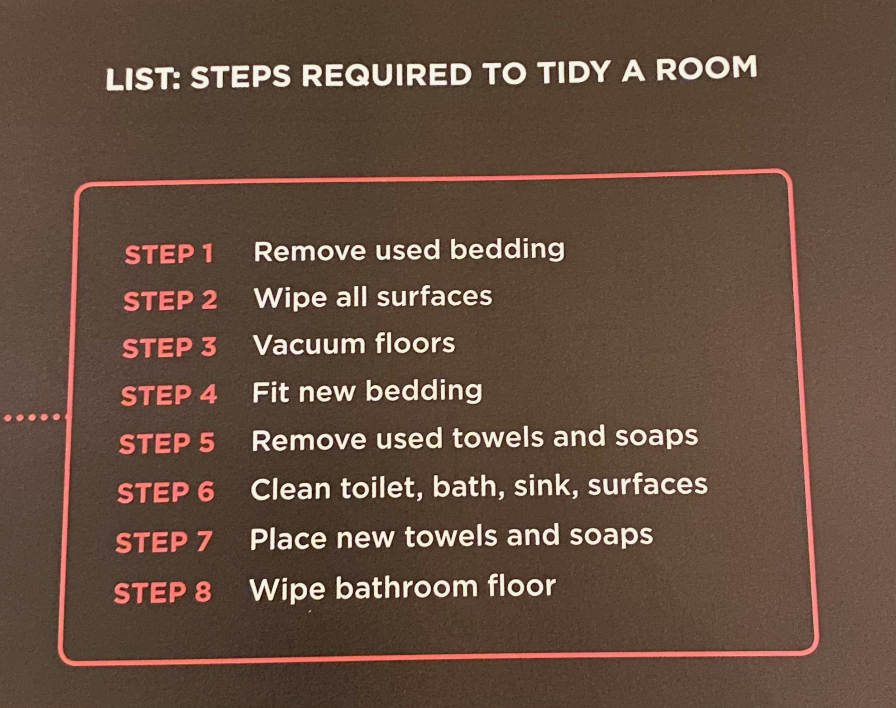

# Read: 01 - Introductory HTML and JavaScript

## **From the Duckett HTML book:**
### Introduction (pp.2-11)
* **HTML**: HyperText Markup Language. The structure and content of a webpage 
* **CSS**: Cascading Style Sheets. The style and layout of a webpage
* How People Access the Internet:
    * **Web browsers**: such as Firefox, Internet Explorer, Google Chrome, Safari, and Opera. Users type a web address into their browser
    * **Web Server**: When you ask your browser for a web  page, the request is sent across the internet to a special computer known as a web server which hosts the website
    * **Devices**: The range of devices to access the internet has increased beyond computers to tablets, phones, laptops, etc. 
    * **Screen Readers**: programs that read out the contents of a computer screen to a user.
* When you look at a website you are looking at the HTML and CSS, and sometimes there are additional features that involve programming languages like JavaScript. More complex sites will use PHP, ASP.Net, Java or Ruby. 
* How the Web Works:
    1.  When you connect to the web you do so via an **Internet Service Provider (ISP)**. You type in a domain to visit a site
    1.  Your computer contacts a network of servers called **Domain Name System (DNS)** servers. These are like a phone book, and they tell your computer the IP address associated with the requested domain name. Every device has its own unique IP address. 
    1.  The unique number the DNS server returns to your device allows your browser to contact the web server that hosts the website you requested. 
    1. The web server sends the page you requested back to your browser


### HTML Chapter 1: “Structure” (pp.12-39)
**HTML describes the structure of pages**. The characters that live inside the angled brackets are called *elements*. Elements are made up of *tags*, usually and opening and closing tag. Tags act like containers and tell you something about the content that will be inside the open and closing tag. 

example 1:
```html
<html>
    <body>
        <h1>This is a headline</h1>
            <p>This is a paragraph. Lorem ipsum dolor sit amet, consectetur adipiscing elit, sed do eiusmod tempor incididunt ut labore et dolore magna aliqua. Ut enim ad minim veniam, quis nostrud exercitation ullamco laboris nisi ut aliquip ex ea commodo consequat</p>
            <h2>This is a subheader</h2>
            <p>Oh look! Another paragraph. Duis aute irure dolor in reprehenderit in voluptate velit esse cillum dolore eu fugiat nulla pariatur.</p>
            <h2>One more subheader</h2>
            <p>And a final paragraph. Excepteur sint occaecat cupidatat non proident, sunt in culpa qui officia deserunt mollit anim id est laborum.</p>
    </body>
</html>
```
#### A Closer Look at Tags


#### Attributes Tell us More about Elements


* Attribute name indicates what kind of extra information you are supplying about the element's content. 
* The value should be placed in "double quotes". 

#### Body, Head & Title
```HTML
<html>
    <head>
        <title>This is the title of the page in your browser</title>
    </head>
    <body>
        <h1>This is the heading for your page<h1>
        <p>This is some content on your page</p>
    </body>
</html>
```
* You can always 'view source' to see the HTML and CSS of a page. 
### HTML Chapter 8: “Extra Markup” (p.176-199)

#### The Evolution of HTML
* HTML 4 (1997): phased out center, font, and strike
* XHTML 1.0 (2000): Introduced some new rules. Other than img, every element needed closing tags. Attributes names had to be lower case. All attributes required a value in double quotes. Deprecated elements no longer used. Elements need to be open and closed within their parent element.
* HTML5 (present)

#### HTML 5
* Start HTML files with ```<!DOCTYPE html>```
* Make comments with ```<!-- -->```
* **id** attributes are used to uniquely identify that element from another element. No two elements should share the same id. Useful for CSS styling.
* **class** attributes help you identify several elements as being different from other elements.
* **Block elements**: start a new line i.e. h1, p, ul, li
* **Inline Elements**: continue on the same line i.e. a, b, em, img
* **div**: allows you to group a set of elements together. Best practice is to use a comment at the end with the same language you picked for your div’s id
* **span**: inline div equivalent. Used to control appearance of these specific elements with CSS. Because of this, span is usually accompanied by id or class.
* **iframe**: Inline Frame. Usually used to embed a Google Map. iframe elements are accompanied with src, height, scrolling (XHTML and earlier), frameborder (XHTML and earlier), and seamless
* **meta**: lives inside the head element. It’s not visible to the user but tells the search engine information about your page. Also uses http-equiv. Author, pragma = prevents browser from caching the page, and expires = when page should expire.
#### Escape characters


### HTML Chapter 17: “HTML5 Layout” (pp.428-451)
* **Old HTML layout**: Developers used div tags with id’s to define the purpose of the div i.e. header, navigation, sidebar, etc.
* **New HTML layout**: Now, some div’s are replaced with the id name; so rather than ```<div id=header>``` you will see ```<header>```. This new way of writing HTML tags helps the author describe the structure of the page.
* **header & footer**: Header may contain site name and main navigation. Footer may contain copyright info. If you have multiple articles on your page you may want headers and footers for each article.
* **nav**: Navigation contains major navigational blocks for the site i.e. home, about, classes, contact, etc.
* **article**: Acts as a container for any section of a page that could stand alone i.e. article, blog, comment forum, etc. If a page has multiple articles you will create multiple article tags that are their own section. You can next article tags.
* **aside**: When used in an article tag, aside should contain content related to the article. When used on its own, it acts as a container for content related to the entire page i.e. links to other sections of the site, search box, etc.
* **section**: Element group that relates content together
* **hgroup**: Group one or more headers so they are treated as one single header (controversial)
* **figure and figcaption**: Use for images, videos, graphs, diagrams, code samples, or text that supports the main body of an article. Accompany with a text description caption.
* **div**: Used to group together related elements.
* linking around block-level elements: Allows you to turn an entire block into a link

Helping older browsers understand: To help older browsers understand HTML5, include the following line of CSS which states new elements should be rendered as block-level elements
#### CSS
```CSS
header, section, footer, aside, nav, article, figure, figcaption { display: block; }
```
#### HTML
```HTML
<!--[if It IE 9]> 
    <script src="http://html5shiv.googlecode.com/svn/trunk/html5.js"></script> 
<![endif]-->
```

### HTML Chapter 18: “Process & Design” (pp.452-475)
**Design your website for your target audience** i.e. individuals vs companies, income, age, etc

**Determine WHY people visit your website?** What are their motivations and goals? Also determine *WHAT* your visitors are trying to achieve i.e. key tasks and motivations. *WHAT* information do your visitors need such as are the visitors familiar with your brand or do you need to explain it? You also want to think about how frequently people will visit your site i.e. once, twice, daily. This will help you determine how often you need to update your site.

Now that you know who is coming, why they are coming, and how they are using your site, **let’s create a site map**. Organize your site map with the card sorting method, and make sure to think about how your visitors will want things organized over how you want things organized. Common card sorting organization will start with *HOME* as the main category, then have sub categories like *ABOUT*, *ARTICLES*, *VISIT*, *SHOP*, *CONTACT*, etc.


**WIREFRAMES**: Sketch of the key information that needs to go on each page of your website. These are simple outlines with no color, fonts, images, etc. Your designer will support with those elements. Be prepared to share wireframes with clients.

Create your *CONTENT*. *PRIORITIZE* what content is the most important and make it distinct with design elements that pop to create a visual hierarchy. *ORGANIZE* or group related content into blocks.

**VISUAL HIERARCHY**: Refers to the order in which your eyes perceive what they see. Since most users will skim your page, create hierarchy through *SIZE*, *COLOR*, and *STYLE*. Larger elements will grab attention. Foreground and background color can create attention. Style can make important elements stand out. Images also create strong visual contrast to draw viewers in. Remember, most of this is subliminal to the viewer. Be intentional.

**GROUPING & SIMILARITY**: Grouping items or making them similar will help your viewer relate items to each other. Things that create this include proximity, closure, continuance, white space, color, borders. Stay consistent with your style. Headings can be very helpful.


**DESIGNING NAVIGATION**: concise (try to limit to 8), clear (predictable), selective, context (colors in the text to indicate which page the viewer is on), interactive (link changes when mouse hovers over it), consistent (keep the navigation the same across all pages).

## **From the Duckett JS book:**

### Introduction
1. Access Content: You can use JavaScript to select any element, attribute, or text from an HTML page.
1. Modify Content: Add elements, attributes, and text to the page, or remove them. 
1. Program Rules: You can specify a set of steps for the browser to follow which allows it to access or change the content of a page
1. React to Events: You can specify that a script should run when a specific event has occurred

#### HTML & CSS Refresh


### JS Chapter 1: “The ABC of Programming” (pp.11-52)
* **A**: What is a script, and how do I create one?
* **B**: How do computers fit in with the world around them?
* **C**: How do I write a script for a webpage?

To write script: (1) Define the goal, (2) Design the script, (3) Code each step. It's always important to define the goal of your script before you start coding. Then, break it down into a series of tasks. Flow charts are useful for this.

#### Image 1: Flow chart

#### Image 2: Steps


#### Image 3: Sketch out the steps in a flowchart

#### Image 4: Flowchart Key


### Computers Create Models of the World Using Data
* Objects: In computer programming, each physical thing in the world can be represented as an *object*. Objects have their own *instances*. Each object has its own:
    * **Properties**: Characteristics of an object. Properties have a *name* and a *value*, and these pairs tell you something about each individual instance of the object. Imagine a hotel listed online. The Hotel is the object, and the properties include things like name, rating, rooms, gym, pool, etc. **Name/Value** pairs are used in a lot of programming. 
    * **Events**: An interaction that changes the value of the properties of an object. Computer's way of sticking up its hand to say "Hey, this just happened!". Programmers choose which events they respond to. When a specific event happens, that event can be used to trigger a specific section of the code. With the hotel example, again the hotel is the **object**, and an **event** could be a customer booking or cancelling a reservation. 
    * **Methods**: Things people need to do with objects. Methods are like questions and instructions that (1) tell you something about an object or (2) change the value of one or more of that object's properties. For the hotel example, Hotels will commonly be asked if any rooms are free. The Object is still Hotel; the method could include the following
    
    Method | What it does:
    -|-
    makeBooking()| increases value of *booking* property
    cancelBooking() | decreases value of *booking* property
    checkAvailability() | subtracts value of *bookings* property from value of *rooms* property and returns number of rooms available

### **Putting it all Together**


* Web Browsers are programs built using objects
* The document object represents an HTML page


### How a Browser Sees a web page
1. Receives a page as HTML code
1. Creates a model of the page and stores it in memory: document object at the top of the model, beneath the document object each box is called a node
1. Uses a rendering engine to show the page on the screen: CSS comes in here

* All major browsers use a JavaScript **interpreter** to translate your instructions (in JavaScript) into instructions the computer can follow

### **How do I write a script for a web page?**
#### How HTML, CSS & JavaScript fit together
Each language forms a separate layer with a different purpose. The Layers build (1) HTML - Content Layer, (2) CSS - Presentation Layer, (3) JavaScript - Behavior Layer. 

These three layers form the basis of a popular approach to building web pages called **Progressive Enhancement**. 

When adding your script, best practice is to add your script reference tags to the HTML just before the closing ```</body>``` tag
#### **How to Use Objects & Methods**

JavaScript runs where it is found in the HTML: When a browser comes across a script element, it stops to load the script and then checks to see if it needs to do anything. 


[⬅ Back to README Home](README.md)