# Read: 02 | HTML Text, CSS Introduction, & Basic JavaScript Instructions

## HTML/CSS book | Ch.2 “Text” (pp.40-61)
* Headings: `<h1> through <h6>`, largest to smallest
* Paragraphs: `<p>`
* Bold & Italic: `<b> & <i>`
* Superscript & Subscript: `<sup> & <sub>`, sup is like 'to the power of' whereas sub is the 2 in 'CO2'
* White Space: A method used in order to make code easier to read
* Line Breaks & Horizontal Rules: `<br /> & <hr />`. br automatically shows text on a new line. hr is used to create a break between themes i.e. change of topic, with a line. These items are known as **empty elements**. They only have 1 tag and they don't have text between them. 
* Visual editors: Often resemble word processors. Styling changes are usually made with a button that's built into the visual editor. 
* Code Views: Shows you the code created by the visual editor so you can manually edit it or enter new code. 
* Semantic Markups: Text elements that are not intended to affect the structure of your web pages, but do add extra information to the pages. 
  * Strong & Emphasis: `<strong> & <em>`. strong elements are bolded. em elements are italic. 
  * Quotations: `<blockquotes> & <q>`. Blockquotes are used for longer quotes that take up an entire paragraph. These will be indented by the browser. q is used to encapsulate text in double quotes (doesn't work in EI). Good practice to pair these with a cite attribute
  * Abbreviations & Acronyms: `<abbr title=>`
  ```HTML
  ex 1: 
  <abbr title="Professor">Prof</abbr>
  ex 2:
  <abbr title="National Aeronautics and Space Administration">NASA</abbr>
  Full word will appear when mouse hovers over NASA
  ```
  * Citations & Definitions: `<cite> & <dfn>`. cite will make the text italic. dfn is a defining instance of a new term. Some browsers show dfn as italics, and it should be used when you are explaining a new term. 
  * Author Details: `<address>` used to contain contact details for the author of the page. Can contain phone number & email address. Browsers display this content in italics
  * Change to content: `<ins>, <del> & <s>`. ins can show content that has been inserted, while del shows text that has been deleted or striked out. s element indicates something that is no longer accurate, but should not be deleted. 
  ex: It was the <del>worst</del> <ins>best</ins> idea she had ever had
  ```HTML
  It was the <del>worst</del> <ins>best</ins> idea she had ever had
  ```
## HTML/CSS book | Ch.10 “Introducing CSS” (pp.226-245)

For CSS, imagine each of your HTML elements in a box. Remember, block level items start on a new line, like h1-h6, p, and div. Inline level elements flow within the text, like b, img, em, span. CSS allows you to create rules that control the way each individual box is presented. 

CSS rules have a **selector** and a **declaration**. ex:
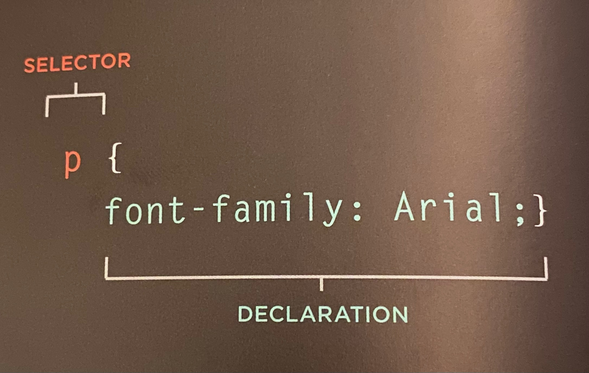
Declarations have a **property** and a **value**. ex: 
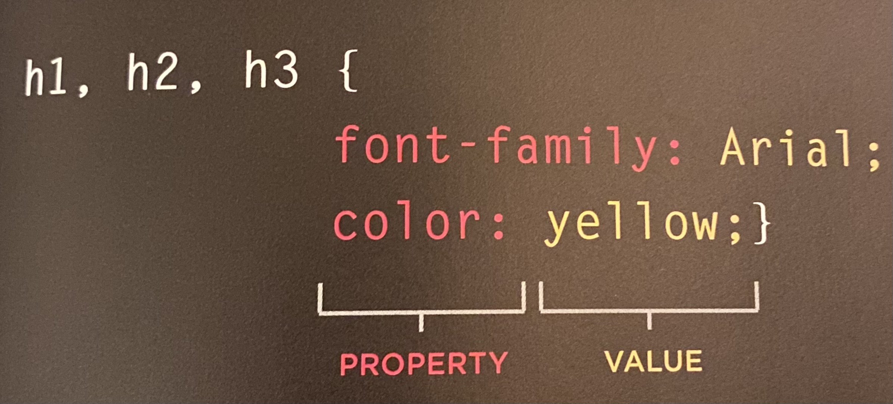

### Using External CSS
* `<link>`: link elements tell the browser where to find the CSS filed used to style the page. Does not need closing tags 
  * `<href>`: Specifies path to the CSS file, usually css or style
  * `<type>`: Specifies the type of doc being linked to, text/css
  * `<rel>`: specifies relationship between the HTML page and the file it is linked to, stylesheet
summary: 
```HTML
<link href="css/style.css" type="text/css" rel="stylesheet" />
```
### Using Internal CSS
You can also use CSS rules by placing them in a 
HTML sheet with style tags. Usually sits in the head element. ex:
```HTML
<style type="text/css">
CSS goes in here
</style>
```
### CSS Selectors
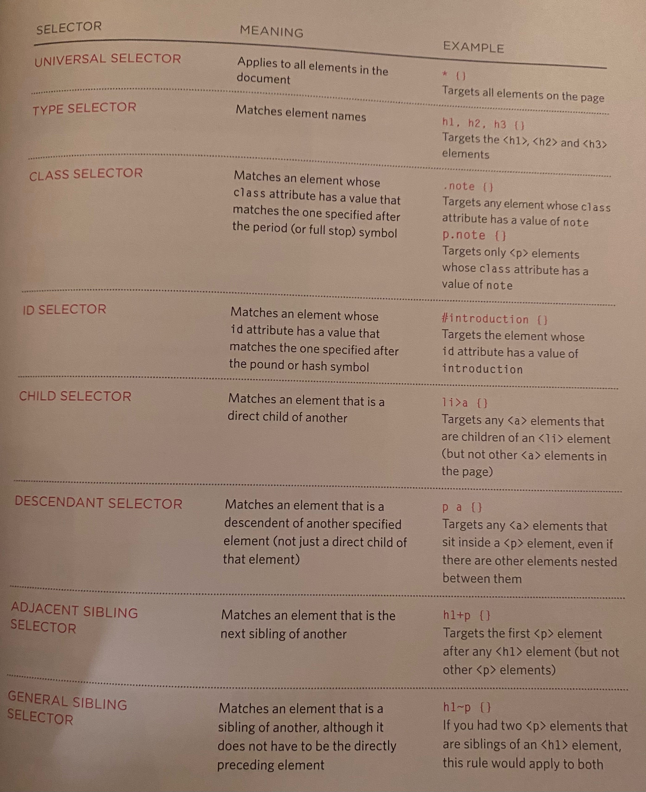

### How Rules Cascade
* LAST RULE: If two selectors are identical, the latter of the two will take precedence
* SPECIFICITY: If one is more specific than the other, the more specific one takes precedence
* IMPORTANT: You can always add !important
* Inheritance: Children tags usually inherit parent tag properties. You can force many properties to inherit values from their parent elements by using `inherit` for the value of the property. 

**Why use external style sheets?**: You have multiple pages on your website that you want to share the same style

**Why use internal style sheets?**: You just want to build 1 page, or you want 1 page on your site to have a unique style. 

**Different versions of CSS & Browser quirks**: Always test your code in multiple browsers and different operating systems. (1) BrowserCam.com, (2) BrowserLab.Adobe.com, (3) BrowserShots.org, (4) CrossBrowserTesting.com .

## JS book | Ch.2 “Basic JavaScript Instructions” (pp.53-84)
Script is a series of instructions your computer follows. The instructions within the script are called **statements**. JavaScript consists of statements, curly brackets to indicate code blocks, and directions on which code should be run based on the scenario.

Write comments to explain what your code does. Multiple line comments are pink bracketed with /* and */. Single line comments are grey and follow //

### Variables
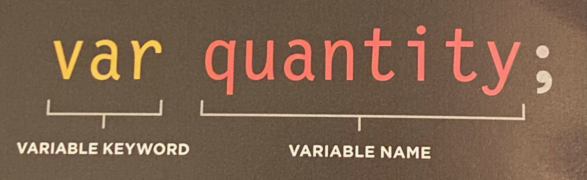
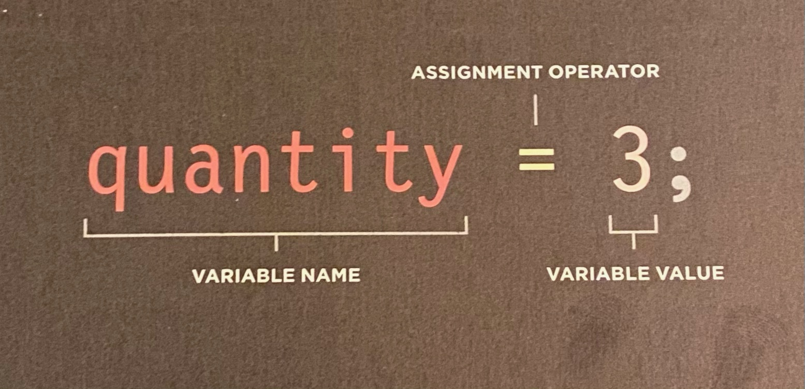
If your variable name is two words, write it as **variableName**. 

### Data Type
Type	| Definition
-|-
Number data type	| handles number
String data type	| consists of letters and characters and is enclosed with quotes
Boolean data type	| true or false data, also - yes or no, 1 or 0, on or off

You can use variables to store numbers, strings, quotes inside of strings, and boolean. Strings must always be written on the same line. Strings can have single or double quotes around them, you just have to stay consistent.
### Shorthand for creating variables
1. Variables are declared. Values assigned in the same statement.
1. Three variables declared on the same line. Values assigned to each.
1. Two variables declared and assigned values on the same line. Then, one is declared and assigned a value on the next line
1. Variable holds reference to an element in the HTML

### Rules for Naming Variables
1. Name must begin with a letter, dollar sign, or underscore. NEVER a number.
1. Name can contain letter, dollar sign, number, or underscore. Cannot contain dash, or period.
1. You cannot use **keywords** or **reserve words**. see [link](https://flaviocopes.com/javascript-reserved-words/)
1. All variables are case sensitive, and it’s bad practice to create two variables that have the same name using different cases.
1. Use a name that describes the kind of information that the variable stores.
1. If your variable contains multiple words, capitalize the first letter of additional words.

### Arrays
Arrays store a list of values. Use arrays when you are working with **lists** that are related to each other. **Array literal** is usually the preferred method for creating an array. The values in this array do not need to be the same data type, so you can store a string, number, and Boolean all in the same array ex:
```javascript
colors = ['white',
          'black',
          'custom'];
```
You can also use **array construct**, but array literal is preferred
```javascript
colors = ('white',
          'black',
          'custom');
```
Items in an array are given an **index**. Values in an array start at 0, not 1. In the previous examples, index numbers are 0=white, 1=black, 2=custom. 

Each array has a property called **length** which holds the number of items in the array. The name of an array is followed by a period symbol (full stop) which is then followed by the length keyword i.e. `colors.length`

* Expressions: There are two types (1) Expressions that just assign a value to a variable (2) Expressions that use two or more values to return a single value
* Operators: allows programmers to create a single value from one or more value
  * Assignment operators: assign a value to a variable `color = 'beige';`
  * Arithmetic operators: Perform basic math `area = 3 * 2;`
  * String operators Combine two strings `greeting = 'Hi ' + 'Molly';`
  * Comparison operators: Compare two values and return true or false `buy = 3 > 5; `
  * Logical operators: Combine expressions and return true or false `buy = (5 > 3) && (2 < 4)`
### Arithmetic Operators
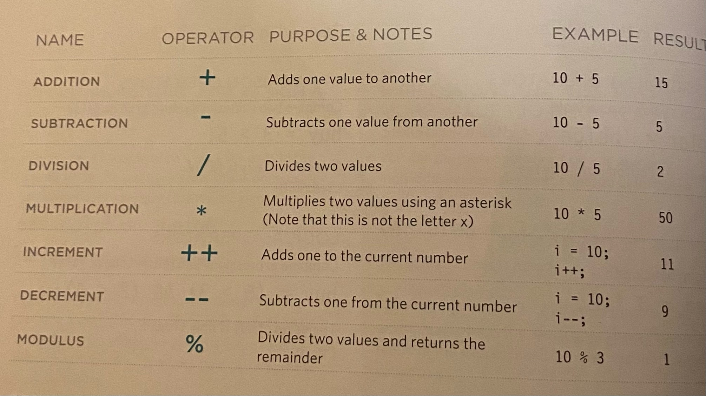
### String Operators
Also known as **concatenation**. ex:
```javascript
var firstName = 'Ivy';
var lastName = 'Stone';
var fullName = firstName + lastName;
```
Note: when you place quotes around a number it becomes a string and you can't do addition operations with it. 

## JS book | Ch.4 “Decisions and Loops” (pp.145-162)
### Decision Making
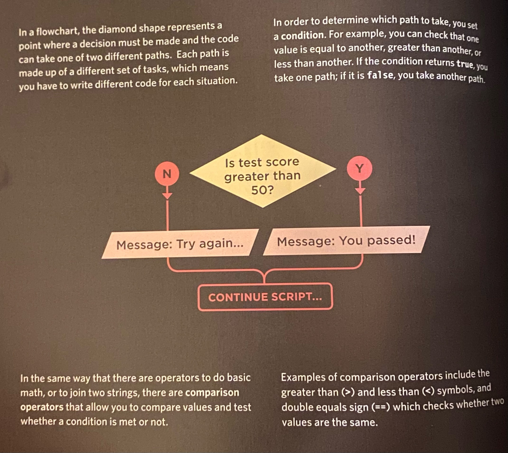
### Evaluating conditions & Conditional Statements

There are two components to a decision:
1. An expression is evaluated, which returns a value
1. A conditional statement says what to do in a given situation

This types of 'if...else' statements are known as **conditional statements**
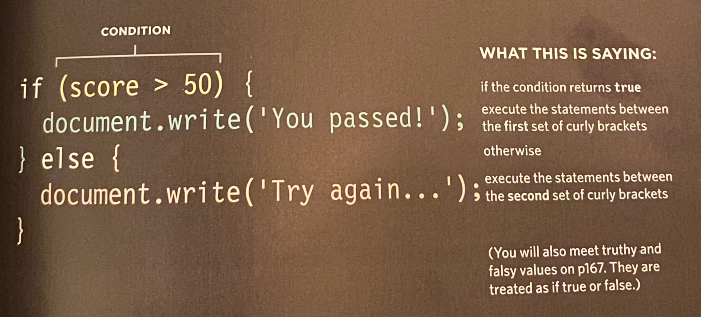

### Comparison Operators: Evaluating Conditions
* == : IS EQUAL TO
* != : IS NOT EQUAL TO
* === : STRICT EQUAL TO
* !== : STRICT NOT EQUAL TO
* `>` : GREATER THAN
* < : LESS THAN
* `>=` : GREATER THAN OR EQUAL TO
* <= : LESS THAN OR EQUAL TO

### Structuring Comparison Operators
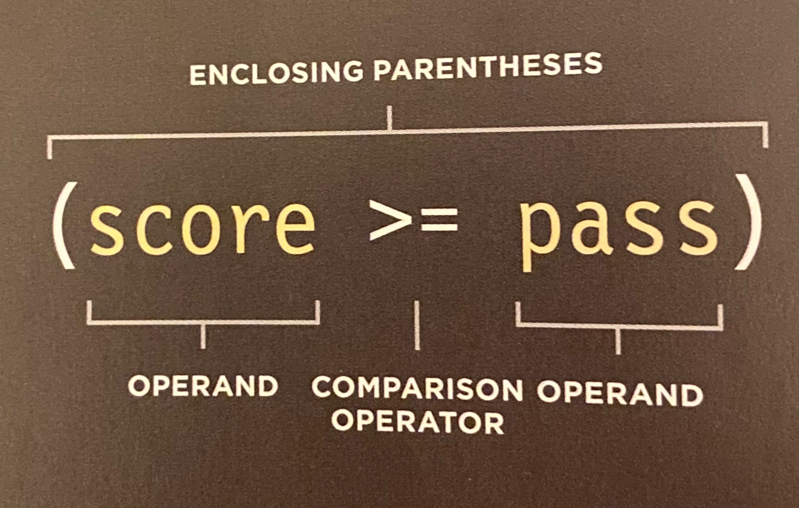
This is an example for a test where you can show the user if they have passed or failed. 
### Using Expressions with Comparison Operators
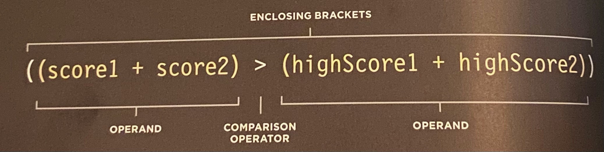
### Logical Operators
allow you to compare the results of more than one comparison operator
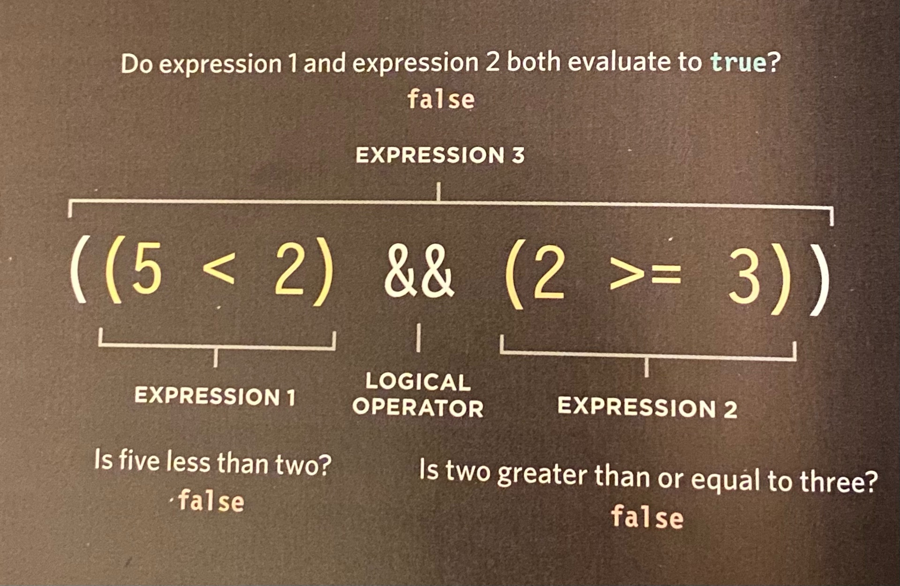
* Logical expressions are evaluated **left** to **right**. 
* && : LOGICAL AND. Test more than one condition. If both expressions are true, then the expression returns true. If just one is false, then the expression returns false. 
* || : LOGICAL OR. Tests at least one condition. If either expression evaluates to true, the expression returns true. If both are false, then the expression is false. 
* ! : LOGICAL NOT. Takes a single Boolean value and inverts it. If it was false it would return true. If the statement is true, it would return false. 

### If statement
Evaluates/checks a condition. If the condition evaluates to **true**, any statement in the subsequent code blocks are executed. If it's **false** the statements in that code block are not run. 
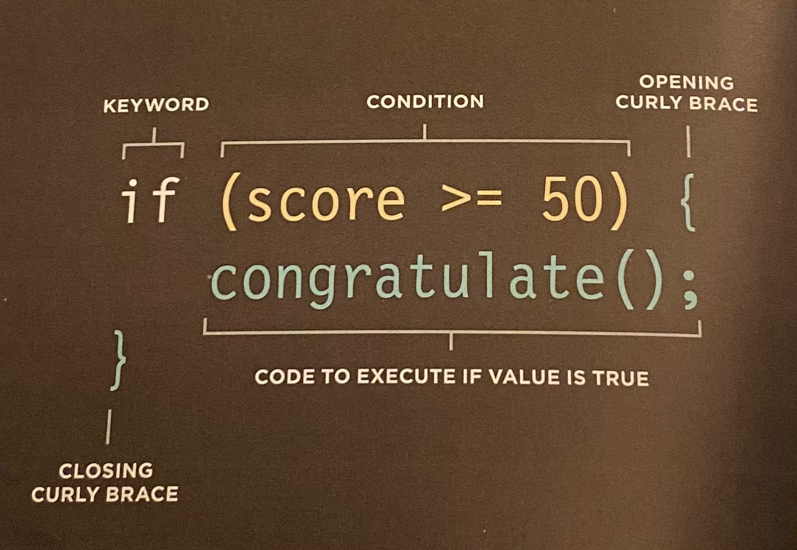
### If...Else Statements
If condition results in false the second code block is run instead
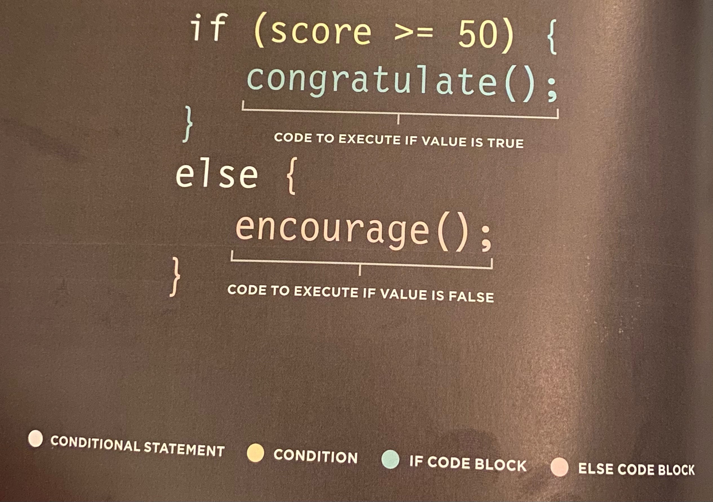


[⬅ Back to README Home](README.md)