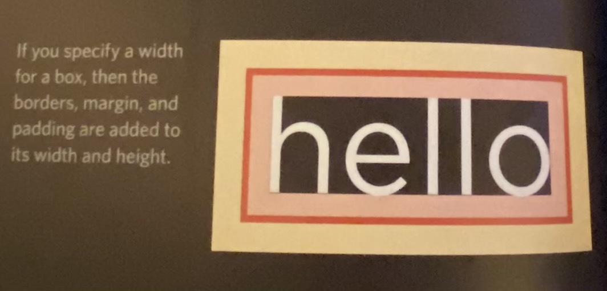
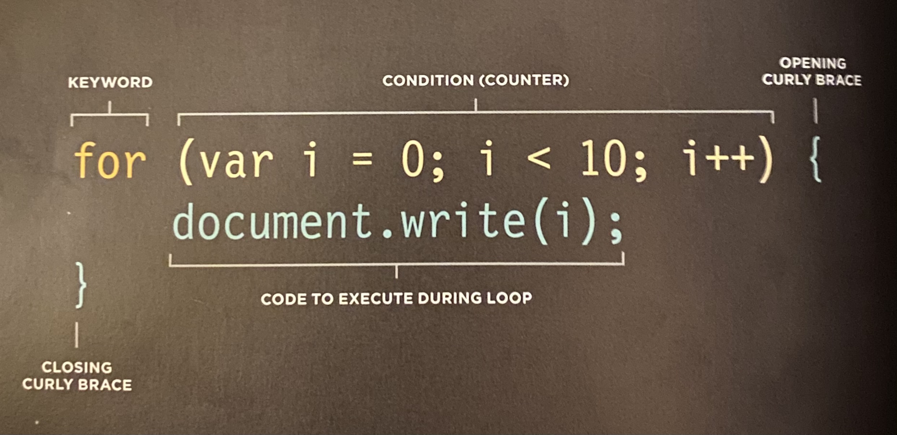

# Read: 03 - HTML Lists, CSS Boxes, JS Control Flow

## HTML/CSS book | Ch.3: “Lists” (pp.62-73)
* **Ordered Lists**: `<ol>` as the parent an `<li>` as the children. Ordered Lists show up as a numbered list.
* **Unordered Lists**: `<ul>` as the parent and `<li>` as the children. Use CSS list-style-type: to change the aesthetic of your bullets
* **Definition Lists**: `<dl>` is the parent, `<dt>` is the term, and `<dd>` is the definition
* You can nest lists within lists i.e. tabbed bullets within an unordered list with be a `<ul>` within a `<ul>`

## HTML/CSS book | Ch.13: “Boxes” (pp.300-329)
* **Box Dimensions** - width, height: 
  * pixels: most popular because it provides a lot of control
  * percentages: sizes box relative to the size of the browser window or container it's inside of
  * ems: size of the box is based on the size of text within it
* **Limiting width** - min-width, max-width: max-width property to ensure lines of text do not appear too wide within a big browser window, and you can use the min-width property to make sure that they do not appear too narrow. 
* **Limiting Height** min-height, max-height: like limiting width, but for height. If the box is not big enough to hold the content, and the content expands outside of the box it can look very messy. 
* **Overflowing content** - overflow: Tells browser what to do if the content contained within a box is larger than the box itself. 
  * hidden: hides any extra content that doesn't fit in the box
  * scroll: adds a scrollbar to the container

### Border, Margin & Padding

Every box has 3 adjustable properties: 
* MARGIN - yellow
* BORDER - red (0px default)
* PADDING - pink

Designers refer to the space between images on a page as **white space**. 

* **BORDER**:
  * **border-width**: controls width of border. px or thin, medium, thick. You *cannot* us % with border. You can control borders with these four properties (1) border-top-width, (2) border-right-width, (3) border-bottom-width, and (4) border-left-width. You can also go clockwise with one property i.e. border-width: 2px, 1px, 1px, 2px
  * **border-style**: solid, dotted, dashed, double, groove, ridge, inset, outset, hidden/none. You can individually change one border side with (1) border-top-style, (2) border-left-style, (3) border-right-style, (4) border-bottom-style. 
  * **border-color**: specified with RGB hex codes or color names. You can also individually color specific sides of your border i.e. top, right, bottom, left with the attribute border-x-color. You can also use shorthand going clockwise
  * **shorthand for border**: shorthand in CSS = border: width, style, color;
* **PADDING**: *Allows you to specify how much space should appear between the content of an element and its border*. Usually specified in pixels. Note that padding is added to width of the box. If you change one element of the box it doesn't overlap, it adds. Again, you can specify which side of the box you want to adjust directionally with padding-top, padding-right, padding-bottom, padding-left. Again, you can shorthand this with padding: 10px, 5px, 3px, 1px. 
* **MARGIN**: *Control gap between boxes*. If one box sits on top of another box, their margins *collapse*. You can either size each side with margin-side, or you can shorthand clockwise with margin: top, right, bottom, left. If your top & bottom are the same, and your sides are the same, you can shorthand even more with margin: side px top/bottom px;. This works with padding too. **TO CENTER CONTENT** you can set left & right margins to auto i.e. margin: 10px auto 10px auto;. For this to work in older browsers you also need to set a text align value.  

### Change inline/block - display
* inline: causes block-level element to act like an inline element
* block: causes an inline element to act like a block-level element
* inline-block: causes a block-level element to flow like an inline element,while retaining other features of a block-level element
* none: hides elements from the page. This should **not** show a block-level element. 

Good example of this is a navigation bar that is created with the list attribute, but you want it to display horizontally. 

### Hiding Boxes - visibility
* This property allows you to hide elements from the user, but keep the box properties and leave a space where the element would be. Set visibility to either **hidden** or **visible**

### Border Images - border-image
This property requires:
1. The URL of the image
1. Where to slice the image
1. What to do with the straight edges: stretch, repeat, round

### Box Shadow - box-shadow
Creates drop shadow around box.
* Horizontal offset: shadow to the left
* vertical offset: top of the box
* Blur distance: If omitted shadow is a solid line line a boarder
* Spread of Shadow: shadow expands in all directions

### Rounded corners - border-radius
rounds corners, and can be set up directionally i.e. border-top-right-radius or shorthand border-radius: 5px, 10px, 5px, 10px

### Elliptical Shapes - border-radius
A way to create more complex shapes by just targeting one corner. 

## JS book | Ch.2: “Basic JavaScript Instructions” (pp.70-73)
*[See Array Notes](https://github.com/LydiaMT/reading-notes/blob/main/201_Read02.md#arrays)*

## JS book | Ch.4: (pp.162-182)
### Switch Statements
starts with a variable called the **switch value**. Each case indicates a possible value for the variable and the code that should run if the variable matches that value. A place where you could use a switch statement is to present the user with a different message depending on which level they are at. 

```javascript
switch (level) {
  
  case 'One':
    title = 'level 1';
    break;
  
  case 'Two':
    title = 'level 2';
    break;
  
  case 'Three':
    title = 'level 3';
    break;
  
  default:
    title = 'Test';
    break;

}
```
### Type coercion & weak typing
* Type Coercion: JS can convert data types behind the scenes to complete an operation
* Weak Typing: data type for a value can change
* Strong Typing: require that you specify what data type each variable will be

DATA TYPE | PURPOSE
-|-
string | Text
number | Number
Boolean | true or false
null | Empty value
undefined | Variable has been declared but not yet assigned a value

### Truthy & Falsy Values
**Falsy**: values are treated as *if* they are false. Falsy values can also be the number 0.
FALSY VALUES
VALUE | DESCRIPTION
-|-
`var highScore = false;` | The traditional Boolean false
`var highScore = 0;` | The number zero
`var highScore = '';` | Empty string
`var highScore = 10/'score';` | Nan (Not a Number)
`var highScore;` | A variable with no value assigned to it

**Truthy**: values are treated as *if* they are true. Truthy values can also be treated as the number 1. The presence of an object or an array is usually considered truty, too. 
TRUTHY VALUES
VALUE | DESCRIPTION
-|-
`var highScore = true;` | The traditional Boolean true
`var highScore = 1;` | Numbers other than zero
`var highScore = 'carrot';` | Strings with content
`var highScore = 10/5;` | Number calculations
`var highScore = 'true';` | true written as a string
`var highScore = '0';` | Zero written as a string
`var highScore = 'false';` | false written as a string

* Unary operator: returns a result with just one operand. 

### Short circuit values
Logical operators are processed left to right. They stop as soon as they have a result, but they return the value that stopped the processing. 

Logical operators will not always return true or false because: (1) They return the value that stopped processing, (2) That value might have been treated as a truthy or falsy although it was not a Boolean. Experienced programmers often write code most likely to return true *first* in OR operations, and false answers first in AND operations. They also place the options requiring the most processing power last, just in case another value returns true and they do not need to run it. 

### Loops
Loops check a condition. If true, a code block will run. This repeats until the condition returns false. Types of loops:
* For: if you need to run code a specific number of times. The **condition** is usually a counter which is used to tell how many times the loop should run. 
* While: If you do not know how many times the code should run. condition can be something other than a counter, and the code will continue to loop for as long as the condition is *true*. 
* Do while: Similar to while, but will always run the statements inside the curly braces at least once, even if the condition is 'false' or 'met'. 

**FOR LOOPS** use a counter as a condition. 
* Initialization: create a variable and set  it to 0. This variable is commonly called i and acts as a counter: `var i = 0` . 
* Condition: The loop should continue to run until the counter reaches a specific number. `i < 10;`
* Update: every time the loop has run the statements in the curly braces, it adds one to the counter `i++`
Bring it all together:
```javascript
var i;
for (i = 0; i < 10; i++( {
  //code goes here
}
```
Example
```javascript
var i;
for (var i = 0; i < 10; i++( {
  document.write(i);
}
```
### Key Loop Concepts
* Keywords: **break** terminates loop and tells interpreter to go onto the next statement of code outside of the loop. **continue** tells interpreter to stop the current iteration, and then update and check the condition again (if true, run again). 

* Loops & Arrays: You might want to write the value of each item stored in an array into the page. You may not know how many items will be in an array when writing a script, but when the code runs, it can check the total number of items in the loop

* Performance issues: You can get stuck in an infinite loop

[⬅ Back to README Home](README.md)
