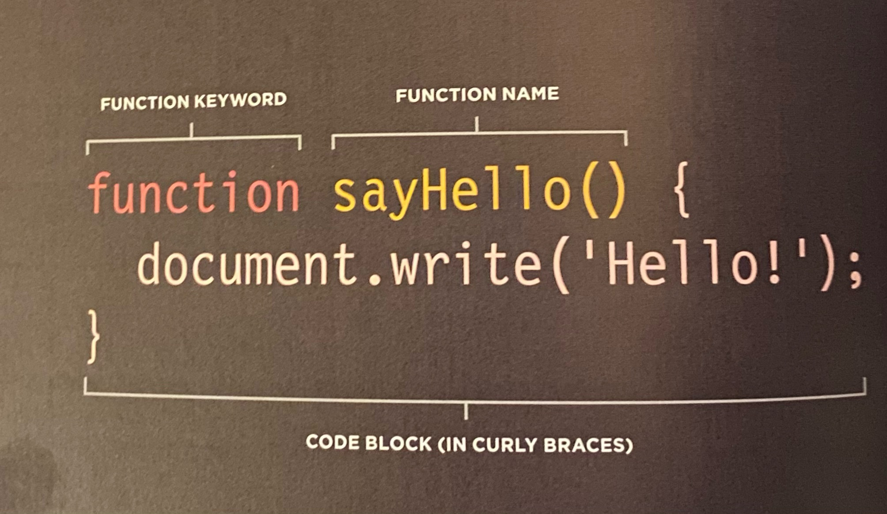
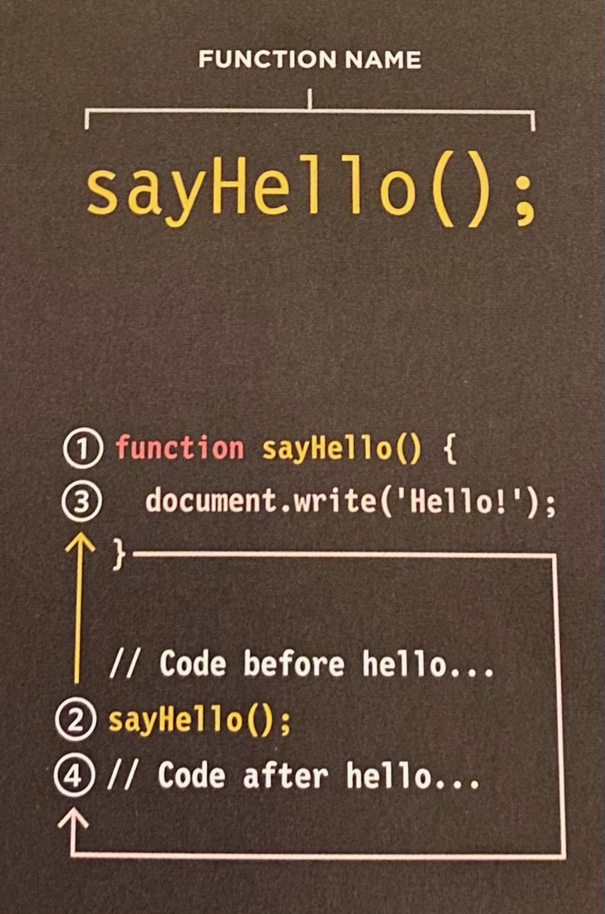
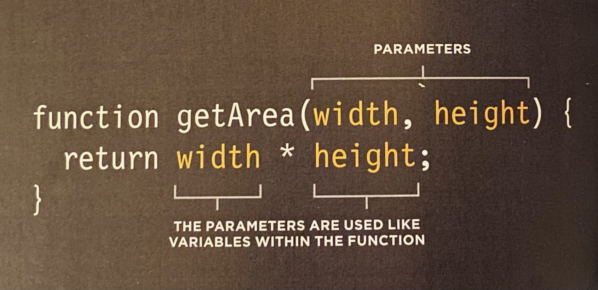
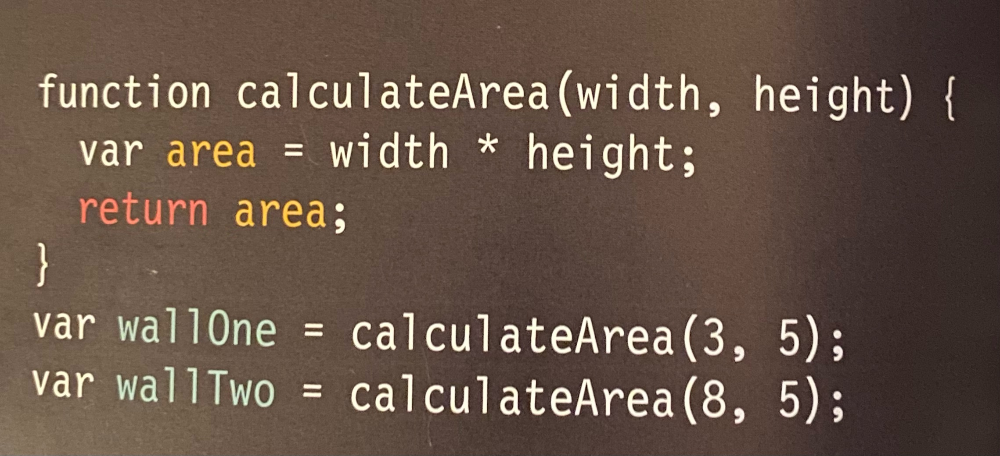
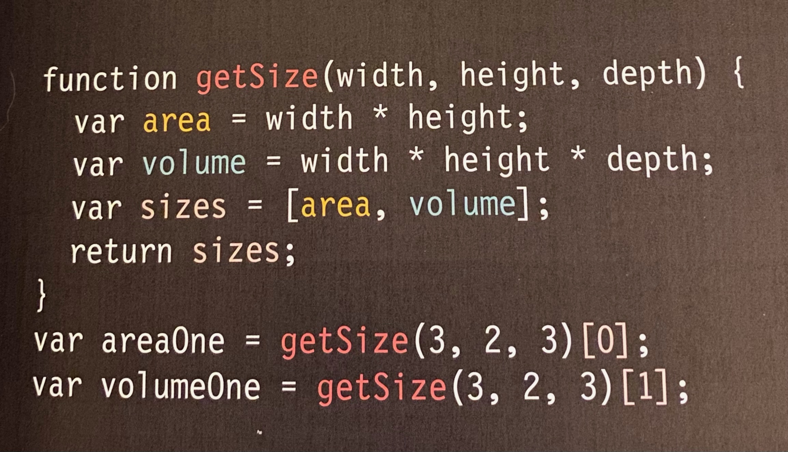

# Read: 04 - HTML Links, CSS Layout, JS Functions

## HTML book | Ch.4 “Links” (pp.74-93)
```HTML
<a href="http://www.imbd.com">IMBD</a>
```
You can link to absolute URLs i.e. browser locations or relative URLs i.e. file locations in your project. You can reference emails with mailto:. 

Use the target attribute to open links in new windows `target="_blank"`

use `a href=#top` after assigning `id=top` somewhere on your page, and you can link the user back to the top of the page. You can assign various links and locations with this method up and down your page. 

## HTML book | Ch.15 “Layout” (pp.358-404)
Key concepts:
* CSS treats each HTML item like a box
* There are block-level boxes and inline boxes
* It can be helpful to put grouped items into `<divs>`

### Controlling positions of elements
* Normal Flow: Default. paragraphs appear one after the other down the page
* Relative Positioning: moves elements from default to top, right, bottom, or left of where it would have been placed.
* Absolute Positioning: position elements in relation to its containing element. 
* Fixed Positioning: similar to absolute, but moves element in relation to the browser window. Good for Headings & Nav bars
* Floating elements: Allows you to move elements far left or right. Be sure to also use the width property to indicate how wide the floated element should be. Good for images and blockquotes. Often paired with the **clear** element. You can clear left, right, both, or none. 

You might have to use **box offset** property to tell the browser how far from the top or bottom and left or right it should be placed. 

**z-index** property allows you to control which box appears on top. Known as **stacking context**. 

Parents of floated elements solution: overflow property is given a value auto & the width property is set to 100%. 

Giving organization with the look of columns is a nice touch. Best practice is to:
  * Assign HTML div element `class=column1of2` and `class=column2of2` etc.... Then assign a width, float, and margin. 

### Screen Size
* iPhone4: 960x640
* iPad 2: 1024x768
* 13" MacBook: 1280x800
* 27" iMac: 2560x1440
* Web designers often create pages 960-1000px wide

### Layouts: adjusted in `<body>` tag
* Fixed Width: Do not change size as the user increases or decreases the size of their browser window. Stay the same width no matter what size the browser window is. Use pixel size.
* Liquid: stretch and contract as the user increases or decreases the size of their browser window. Stretches or shrinks to fit the screen. Use percentage. 

[Use 960.gs](https://960.gs/)
[Use Blueprint](http://blueprintcss.org/)
[Use Less Framework](https://lessframework.com/)

You might want to use multiple style sheets for your websites to organize different features of your site. You can link these to your HTML index per usual, or you can add @import to your CSS style sheet. 

## JS book | “Functions, Methods, and Objects” (pp.86-99 ONLY)
### What is a function?: A function lets you group a series of statements together to perform a specific task. 
Statements in a function aren't alway executed when the page loads. For example, you might not want a task to run until the user clicks on a specific element on the page. 

Steps the function needs to perform are packaged in a code block

Code blocks consist of one or more stastatementstement contained within curly braces. Some functions need information or **parameters**. When your function provides an answer, this is known as a **return value**. 

Most programming languages depend on a name/value pairing. the name is like a variable name i.e. variableName, and the value is the statement in the code block. When you call a function by its name, the value will run. 

### Declaring a Function
**Function Declaration**: To create a function, you give it a name and then write the statements needed to achieve its task inside the curly braces. 


### Calling a Function 
Having declared the function, you can then execute all of the statements between its curly braces with just one line of code. This is known as **calling the function**. 


### Declaring Functions that need Information
Sometimes you need specific information to perform a task. When you do, you declare the function with **parameters**. They act kind of like variable names. 

Argument as values: 
```
getArea(3, 5)
```
Arguments as variables: 
```md
wallWidth = 3;
wallHeight = 5;
getArea(wallWidth, wallHeight)
```
### Calling Functions that need Information
**Parameters vs arguments**: 
  * Parameters: words that act like variables i.e. width and height
  * Arguments: values that you pass into code like getArea(wallWidth, wallHeight)

### Getting a Single Values out of a Function

Inside this function, a variable called **area** is created which holds the calculated area of the box. The **return** keyword is used to return a value to the code that called the function. **wallOne** area is 15, which was calculated by the calculatedArea(). **wallTwo** has the area of 40. This shows how the same function can be used to perform the same step with different values

### Getting Multiple values out of a Function
Functions can return more than one value using an array

Multiple variables are assigned and calculated within the function. getSize can then be called from the function. You are basically using the function to make calculations for you once it's called. 

### Anonymous Functions & Function Expressions
Function Declaration: creates a function you can call later in your code. To call on this function later, you would use `area()`
```javascript
function area(width, height) {
  return width * height;
}

var size = area(3,4)
```
Function Expression: Anonymous function because it does not have a name. It can be called like any function created with a function declaration. Function is not processed until the interpreter gets to that statement. 
```javascript
var area = function(width, height) {
  return width * height;
};

var size = area(3,4)
```
### Immediately Invoked Function Expressions (IIFE)
These types of functions hold the value returned from the function rather than storing the function itself. 
```javascript
var area = (function() {
  var width = 3;
  var height = 2;
  return width * height;
}());
```
Anonymous and IFFES - When should they be used?
* For code that only needs to run once within a task, rather than repeatedly being called by other parts of the script
  * As an argument when a function is called
  * To assign the value of a property to an object
  * In event handlers and listeners to perform a task when an event occurs
  * To prevent conflict between two scripts that might use the same variable names

### Variable Scope & Memory
* **Local Variables**: variables created in a function cannot be accessed outside of the function. You will also NOT encounter naming conflicts with variables used inside the function. 
* **Global Variables**: variables created outside of the function can be used anywhere. These take up memory, so try to use local variables when possible.

## 6 Reasons for Pair Programming
[Link to Article](https://www.codefellows.org/blog/6-reasons-for-pair-programming/)

* Driver: Only one who's typing
* Navigator: Uses their words to guide the driver. They do not write any code
* When learning a new language you need to listen, speak, read, and write the language. 

It's efficient and collaborative. Everyone programs a bit differently too, so it's a great way to learn and teach each other your own approach. It's great for improving social skills. It preps you for interviews and gets you ready for real world work environment situations. 

[⬅ Back to README Home](README.md)
