# Read: 06 - JS Object Literals; The DOM

## Ch.3 | “Object Literals” (pp.100-105)
* In an object, variables become known as **properties**
* In an object, functions become known as **methods**
* Like variables, and named functions, properties and methods have a name and a value. in an object that name is a **key**
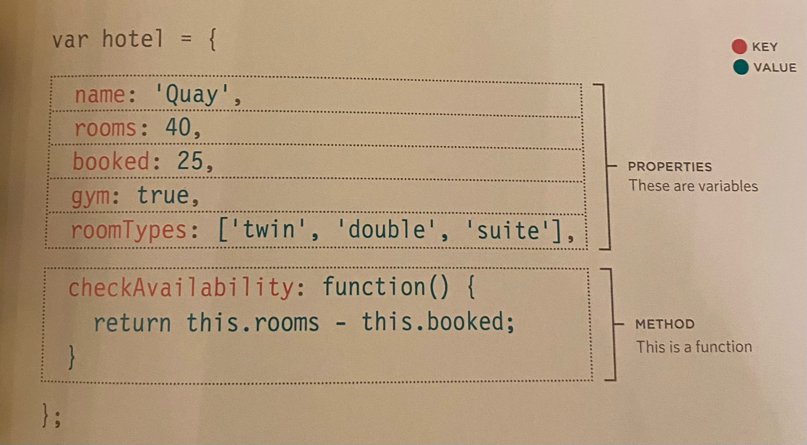
Accessing an object and dot notation
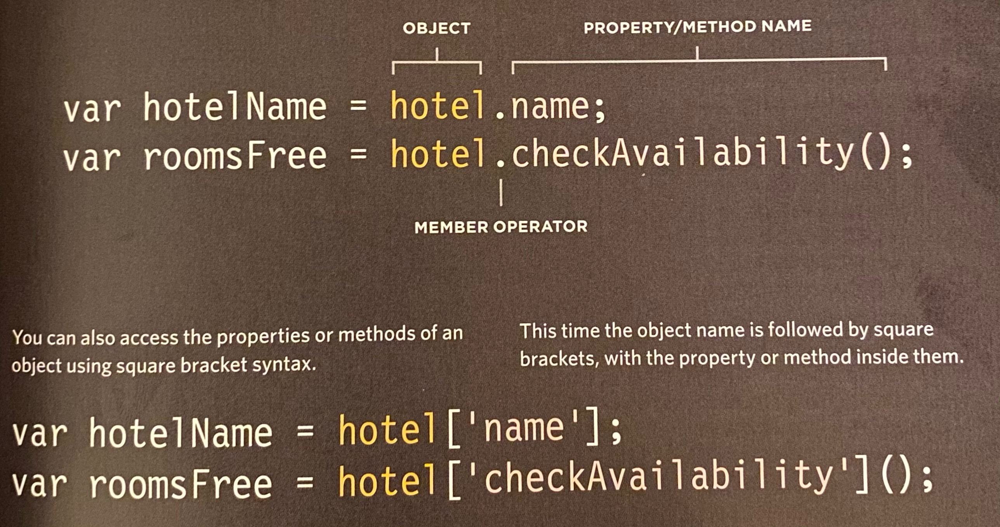
Model of the object hotel with method .name and .checkAvailability 
Will result in 'hotelName': Park and 'rooms': 43 
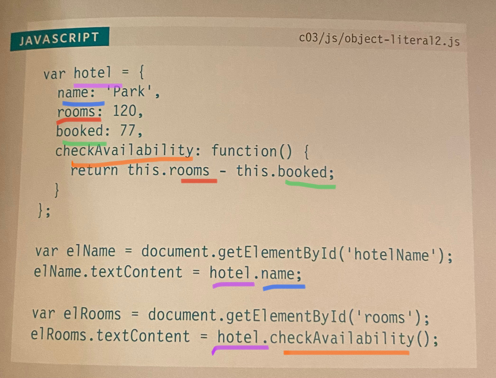

## Ch.5 | “Document Object Model” (pp.183-242)
### The DOM Tree is a model of a web page
* As a browser loads a web page, it creates a model of that page. It consists of 4 main types of nodes:
1. The Document Node (YELLOW): This node represents the entire page. Starting point for all DOM trees
1. Element Node (GREEN): elements that describe the structure of the page i.e. hi-h6, p, ul, etc. 
1. Attribute Node (PINK): Note that attributes are not *children* of the elements, they are a *part* of the elements. 
1. Text Node (PURPLE): once you have accessed an element you can reach the text of that element. Text nodes cannot have children

### Body of HTML Page
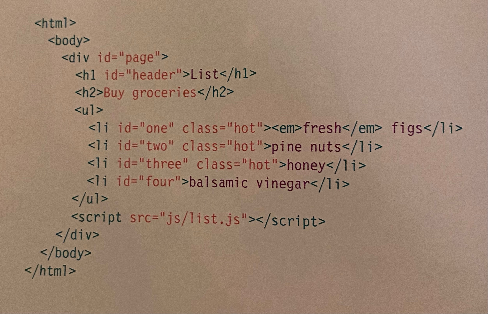
### DOM Tree
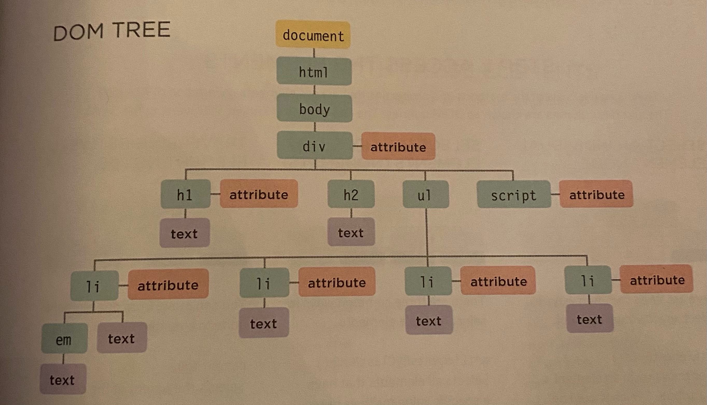
Accessing and updating the DOM tree involves two steps
1. **Locate** the node that represents the element you want to work with
1. **Use** its text content, child elements, and attributes 
Methods that find elements in the DOM are called **DOM queries**. 
### Methods that return a single element node
```javascript
getElementById('id') //Selects an individual element given the value of its id attribute. HTML must have a corresponding id attribute for this to work

querySelector('css selector') //Use CSS selector syntax that would select one or more elements. This method returns only the first of the matching elements

```
### Methods that return one or more element (as a nodelist)
```javascript
querySelectorAll('css selector')//Uses CSS selector syntax to select one or more elements and returns all of those that match

getElementsByClassName('class')//Selects one or more element given the value of their class attribute. HTML must have a class attribute for this to work. Faster than querySelectorAll.

getElementByTagName('tagname')//Selects all elements on the page with the specified tag name. Faster than querySelectorAll.
```
### Methods that select individual elements
This code will return the element node for the **element** whose **id attribute** has a value of **one**
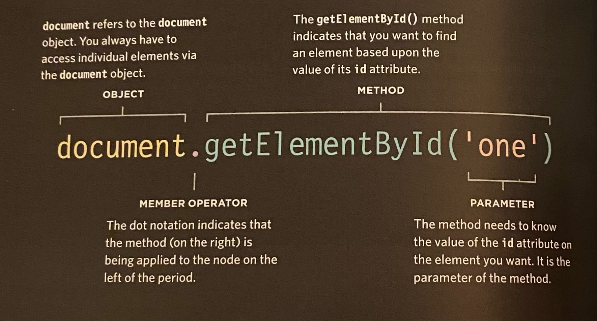

### Nodelists: DOM queries that return more than one element
A **NodeList** is a collection of nodes. Each node is given an index number, similar to an array. However, NodeLists are not technically arrays; they are a type of object called a **collection**
```javascript
//Refer to DOM tree image above for examples below

getElementsByTagName('h1')//Even though this query only returns one element, the method still returns a NodeList because of the potential for returning more than one element

getElementsByTagName('li')//returns four elements, one for each of the <li> elements on the page. The are assigned index numbers 0, 1, 2, and 3

getElementsbyClassName('hot') //This NodeList contains only three of the <li> elements because we are searching for elements by the value of their **class attribute**, not tag name. 

querySelectorAll('li[id]') //This method returns four elements, one for each of the <li> elements on the page that have an id attribute
```
There are two ways to select an element from a NodeList:
1. THE item() METHOD: Stores an element from the node list in a variable i.e. `var firstItem = elements.item(0);`
1. Array Syntax: Gets element from a NodeList i.e. `var firstItem = elements.item[0];`. **This method is preferred** because it is faster. 

When you have a NodeList, you can loop through each noe in the collection and apply the same statements to each with a for loop. 

ex. Changes all li items with the class attribute 'hot' to 'cool'


### Traversing the DOM
When you have an element node, you can select another element in relation to it using these five properties:
1. **parentNode**: Finds element node for the containing element in the HTML
1. **previousSibling or nextSibling**: Finds the previous or next sibling of a node if there are siblings
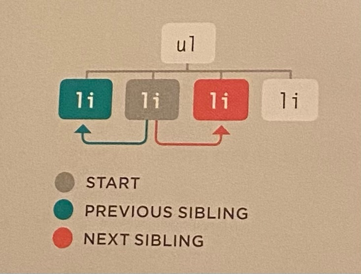
1. **firstChild or lastChild**: Finds the first or last child of the current element
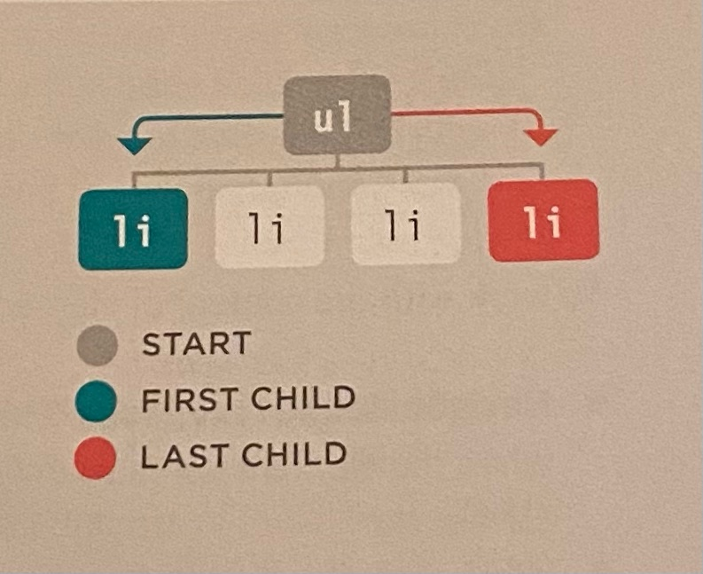

### Whitespace Nodes
Most browsers treat whitespace between elements as a text node. You could strip all whitespace out of a page before serving it to the browser, but this makes the code hard to read. You can also avoid using these DOM properties all together (previousSibling,  nextSibling, firstChild, or lastChild)

### How to get/update element content
* Navigate the the text node
* Work with the containing element
* use common property: **nodeValue**

### Access and update a text node with nodevalue
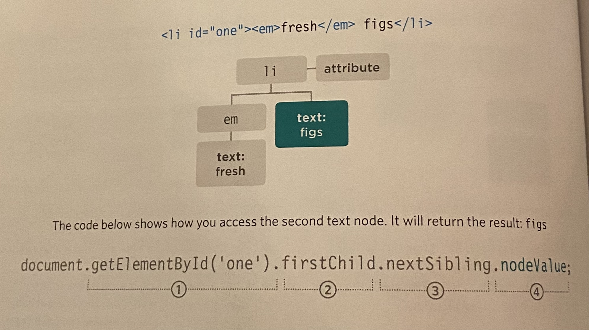
1. The `<li>` element is selected using the getElementById() method
1. The *firstchild* of `<li>` is the `<em>` element
1. The text node is the *next sibling* of that `<em>` element
1. You have the text node and can access its contents using nodeValue

### Accessing and changing a text node
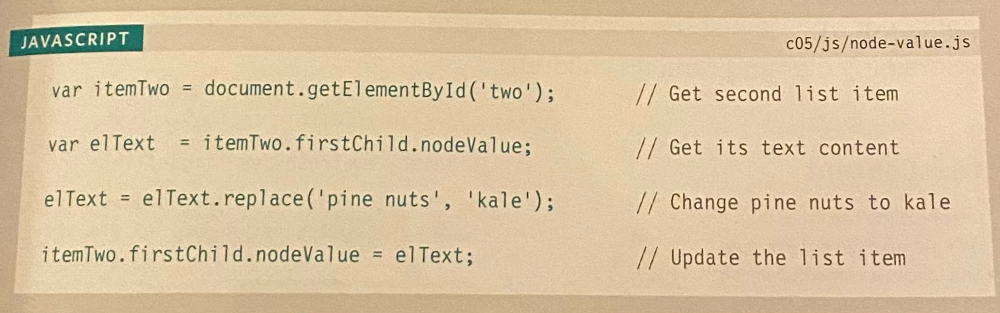
* textContent: To collect text from an element
* innerText: avoid this method if possible
* innerHTML: gets content of an element and returns it as one long string

### Adding elements using DOM manipulation
1. createElement()
1. createTextNode()
1. appendChild()
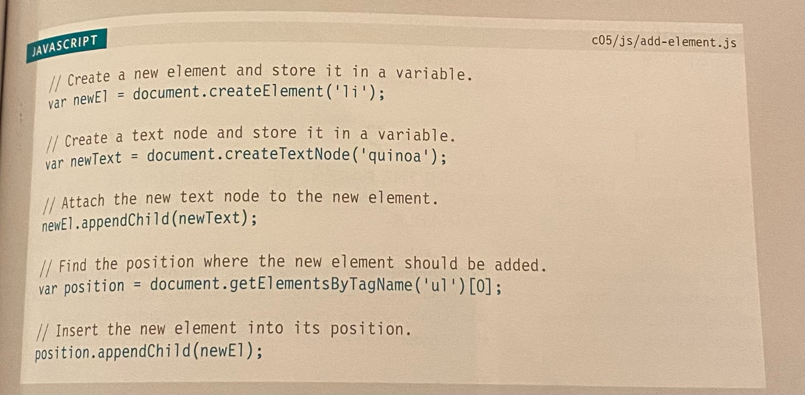
You can also remove elements via removeChild()
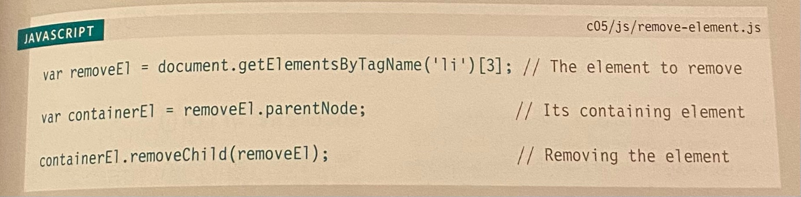

### Cross-Site scripting XSS Attacks
If you add HTML to a page using innerHTML (or several other jQuery methods) you need to be aware of XXS; otherwise an attacker could gain access to your user's accounts. (see pg 228-321 for details on what to avoid)

### Attribute Nodes:
1. getAttribute(): gets the value of an attribute
1. hasAttribute(): checks if element node has a specific attribute
1. setAttribute(): sets the value of an attribute
1. removeAttribute(): removes an attribute from an element node


[⬅ Back to README Home](README.md)
