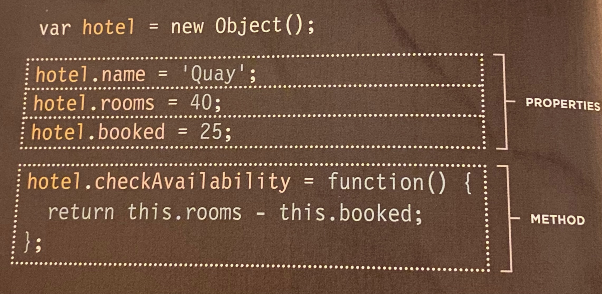
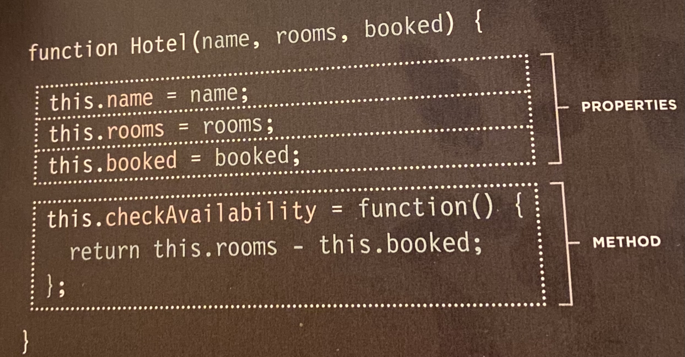

# Read: 07 - HTML Tables; JS Constructor Functions

## Domain Modeling
[Link to article](https://github.com/codefellows/domain_modeling#domain-modeling)

This is object-oriented programming in JavaScript at its most fundamental level.

1. The new keyword instantiates (i.e. creates) an object.
1. The constructor function initializes properties inside that object using the `this.` variable.
1. The object is stored in a variable for later use.

**Methods can be added to a constructor function's prototype**


## HTML book Ch.6: “Tables” (pp.126-145)

HTML | Description
-----|-----
`<table>` | Used to create a table
`<tr>` | Start of each row (table row)
`<td>` | Start of each cell (table data)
`<th>` | Table header. Used just like tr, but it's purpose is to represent the header
`colspan="number of columns"`  | Indicates how many columns a cell should run
`rowspan="number of rows"` | Indicates how many rows a cell should run
`<thead>, <tbody>, and <tfoot>` | Help distinguish between the main content of the table and the first and last rows
Old code | in old HTML, width and color were defined the the HTML element tags

## JS Book| Ch.3: “Functions, Methods, and Objects” (pp.106-144)

### Creating an Object

### Creating many Objects

You create instances of the object using the constructor function. The new keyword followed by a call to the function creates a new object. The name of a constructor function usually begins with a capital letter
```javascript
var quayHotel = new Hotel('Quay', 40, 25);
```
### Ways to Create Objects
```javascript
//Literal Notation
var hotel = {}
//Object Constructor Notation
var hotel = new Object();
//Properties for either notation
hotel.name: 'Quay';
hotel.rooms: 40;
hotel.booked: 25;
hotel.checkAvailability = function(){
  return this.rooms - this.booked;
```
### Storing Data
* Variables: a variable has just one key and one value
* Arrays: can store multiple pieces of information. Each piece of information is seperated with a comma. Order of the values is IMPORTANT because of the assigned index numbers in arrays. Values in an array are put into square brackets. Arrays are technically a special type of object. You can also have objects in an array
* Individual Objects: Objects store stes of name/value pairs. They can be properties or functions. Order is NOT IMPORTANT. You can have arrays in the values of your object properties
* Multiple Objects: use an object constructor to provide a template for the objects, and then create instances of the object using the new keyword and then a call to the constructor function i.e.
```javascript
function Hotel (name, rooms) {
  this.name = name;
  this.room = room;
}

var hotel1 = new Hotel ('Quay', 40)
var hotel2 = new Hotel ('Quay', 120)
```
### Types of Built-in Objects
1. Browser Object Model: *see page **124** for common window.properties*
2. Document Object Model: *see page **126** for common document.properties*
3. Global Javascript Objects: *see page **128** for common methods* 
  * see page 134 for common *math* methods. 
  * see page 137 for common *date and time* methods. 

[⬅ Back to README Home](README.md)
