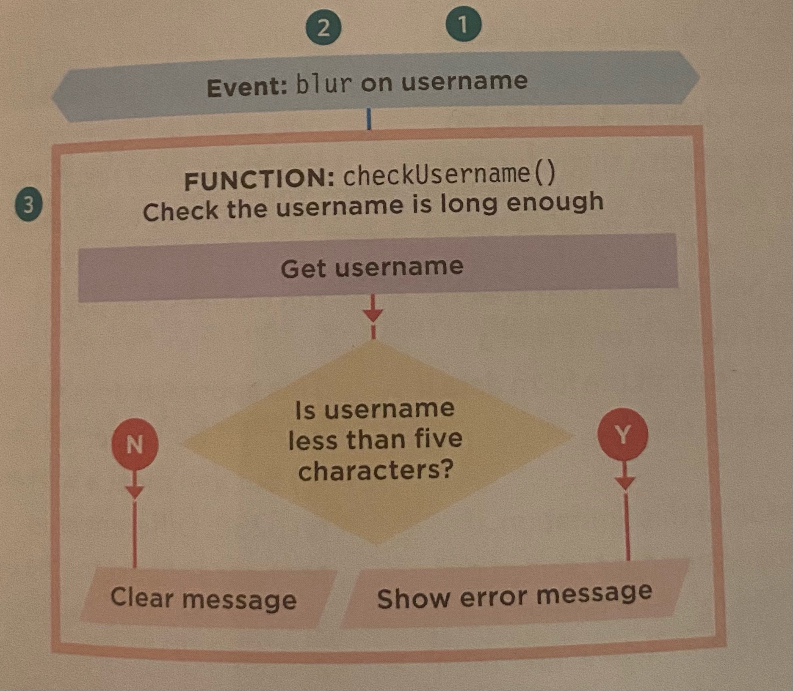
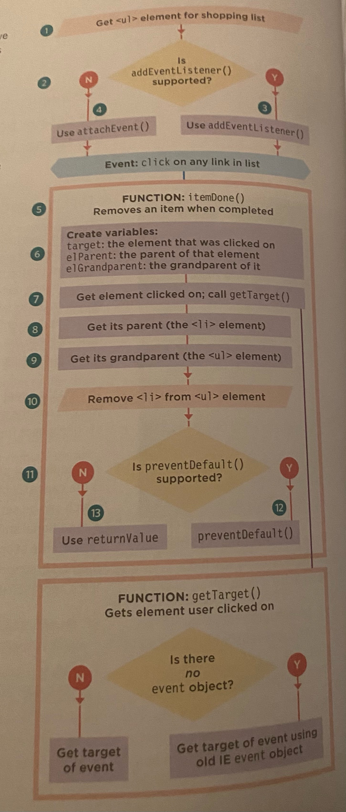

# Read: 09 - Forms and Events

## HTML | Ch.7: “Forms” (p.144-175)
* Best known form is a search box
* Types of controls:
  * Adding text: (1) text input, (2) password input, (3) text area
  * Making Choices: (1) radio button, (2) checkboxes, (3) Drop-down boxes
  * Submitting Forms: (1) submit button, (2) Image button, (3) file upload

### Form Structure
* `<form>`: will always carry an action attribute, and will usually have a method id attribute too. Actions indicate the link to the server. Methods will be 'get' or 'post'. 
* Text input:`<input>`, type="text", name, `maxlength`
* Password input: `<input>`, type="password", name, `size, maxlength`
* Text Area: `<textarea>`
* Radio Button: `<input>`, type="radio", name, value, checked. Cannot be deselected
* Checkbox: `<input>`, type="checkbox", name, value, checked
* Drop down list: `<select>`, name, `<option>`, value, selected. Also cannot be deselected, better to use for long lists like picking country
* Multiple Select Box: `<select>`, size, multiple
* File input Box: `<input>`, type="file"
* submit button: `<input>`, type="submit", name, value
* Image Button: `<input>`, type="image"
* Button & Hidden Controls: `<button>`, `<input>`, type="hidden"
* Labelling Form Control: `<label>`, for
* Grouping Form Elements: `<fieldset>`, `<legend>`

**HTML5**
* Form Validation
* Date input: `<input>`, type="date
* Email & URL input: `<input>`, type="email", type="url"
* Search Input: `<input>`, type="search", placeholder


## HTML | Ch.14: “Lists, Tables & Forms” (pp.330-357)
* Bullet Point Styles: `list-style-type` unordered list = none, disc, circle, square. Ordered list = decimal, decimal-leading-zero, lower-alpha, upper-alph, lower-roman, upper-roman
* Images for bullets: `list-style-image`
* Positioning the marker: `list-style-position` outside or inside
* List shorthand: `list-style`
* Table Properties
  * width
  * padding
  * text-transform
  * letter-spacing, font-size
  * border-top, border-bottom
  * text-align
  * background-color
  * :hover
* Table styling tips:
  * Give cells padding
  * distinguish headings
  * shade alternate rows
  * align numerals
* Border on Empty Cells: `empty-cells` show, hide, inherit
* Gaps between cells: `border-spacing, border-collapse`
* Cursor Styles: `cursor` auto, crosshair, default, pointer, move, text, wait, help, url('cursor.gif')

## JS | Ch.6: “Events” (pp.243-292)

### Different Event Types
* See pages 246-247 for table of different event types
* Events fire or are raised: this refers to when an event has occurred
* Events trigger scripts
* Event Handling
  1. Select the element node(s) you want the script to respond to. Likely to use DOM query
  1. Indicate which events on the selected node(s) will trigger the response: Known as BINDING an event to a DOM node
  1. State the code you want to run when the event occurs
  1. Select element
  1. Specify Event
  1. Call Code 

Three ways to bind an event to an element
  1. HTML Event Handlers: Old code
  1. Traditional DOM event Handlers: can only attach a single function
  1. DOM Level 2 Event Listeners: One event can trigger multiple functions. Less likely to be conflicts with scripts that run on the same page

### Traditional DOM event handlers
* You can only attach one function at a time
```javascript
function checkUsername() {
  //code to check the length of username
}
var el = document.getElementById('username');
el.onblur = checkUsername;
```
### Event Listeners
* They can deal with more than one function at a time, but they are not supported in old browsers
* addEventListener
```javascript
function checkUsername() {
  //code to check the length of username
}
var el = document.getElementById('username');
el.addEventListener('blur', checkUsername, false);
```
Because you cannot have parentheses after the function name in event handlers or listeners, passing arguments requires a workaround
```javascript
el.addEventListener('blur', function () {
  CheckUsername(5);
}, false);
```
For old browser like IE, you can use a helper function 
```javascript
if(el.addEventListener) {
  el.addEventListener('blur', function() {
    checkUsername(5)
  }, false );
} else {
  el.attachEvent('onblur', function () {
    checkUsername(5);
  });
}
```
### Event Flow
* Events flow in two directions: (1) Event Bubbling where event starts at the most specific node and flows outwards to the least specific one and (2) Event Capturing where event starts at the least specific node and flows inwards - not supported by old browsers. 

### Event Object
* When an event occurs, the event object tells you information about the event, and the elements it happened upon. 
Event listener with no parameters
```javascript
function CheckUsername(e){
  var target = e.target; //get target of event
}

var el = document.getElementById('username');
el.addEventListener('blur', checkUsername, false);
```
Event listener with parameters
```javascript
function checkUsername(e, minLength) {
  var target = e.target; //get target of event
}

var el = document.getElementById('username');
el.addEventListener('blur', function(e){
  checkUsername(e, 5);
}, false);
```
### Using Event Listeners with the Event Object
* See code block on page 265

### Event delegation
* Events can take a lot of memory
* best to delegate event listeners to ancestor element when possible
* If you add new elements to DOM tree you do not have to add event handlers
* `preventDefault() / returnValue = false`: to prevent the user from being taken to another page
* `stopPropagation()`
* Flow chart


### User Interface Events:
* load
* unload
* error
* resize
* scroll

### Focus and blur events
* helpful when you want to show tips or feedback to a user as they interact  with an individual element
* You need to trigger form validation as a user moves from one control to the next 
  * focus
  * blur
  * focusin
  * focusout

### Mouse Events
* fires when mouse is moving and when buttons are clicked
  * click
  * dblclick
  * mousedown
  * mouseup
  * mouseover
  * mouseout
  * mousemove
* try to only use this on items that are clicked

### Keyboard events
* input
* keydown
* keypress
* keyup
* to know what key was pressed: `String.fromCharCode(event.keyCode);`

### Form Events
* submit
* change: i.e. user selects checkbox, radio button, dropdown. Use this rather than click because users can tab into an event. 
* input

### Mutation Events & Observers
* DOMNodeInserted
* DOMNodeRemoved
* DOMSubtreeModified
* DOMNodeInsertedIntoDocument
* DOMNodeRemovedFromDocument

### HTML5 Events
* DOMContentLoaded
* hashchange
* beforeunload

[⬅ Back to README Home](README.md)
