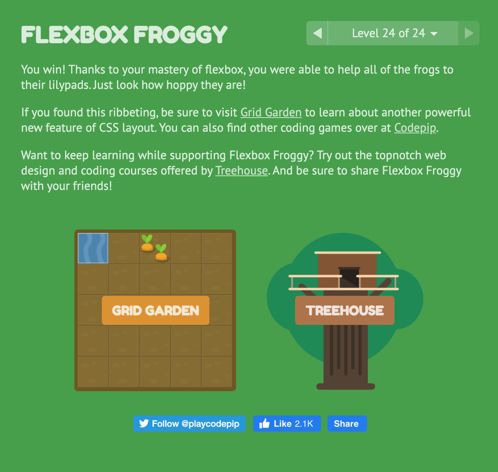
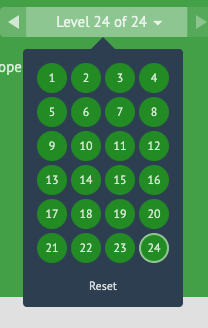

# Readings: MUSTACHE and FLEXBOX

## Reading
* [Templating with Mustache](https://1sherlynn.medium.com/javascript-templating-language-and-engine-mustache-js-with-node-and-express-f4c2530e73b2)
* [A Guide to Flexbox](https://css-tricks.com/snippets/css/a-guide-to-flexbox/)
* [Flexbox Froggy](https://flexboxfroggy.com/): Complete all steps of this tutorial

## Bookmark/Skim

* [Reference: Mustache.js Official Documentation](https://github.com/janl/mustache.js)


### Templating with Mustache

{{placeholder}} using Mustache syntax

* To install with Yarn: `$ yarn add mustache-express`
* To install with NPM: `$ npm install mustache --save`
* To configure: add to your server.js/app.js/index.js file as a variable i.e. `var mustacheExpress = require('mustache-express')`
* Add templates to a folder
* Router configuration: `res.render('hello', {"name": "Sherlynn"})`

### A Guide to Flexbox

```CSS
.container {
  display: flex; /* or inline-flex */
}
```
```CSS
.container {
  flex-direction: row | row-reverse | column | column-reverse;
}
```
```CSS
.container {
  flex-wrap: nowrap | wrap | wrap-reverse;
}
```
```CSS
.container {
  flex-flow: column wrap;
}
```
```CSS
.container {
  justify-content: flex-start | flex-end | center | space-between | space-around | space-evenly | start | end | left | right ... + safe | unsafe;
}
```
```CSS
.container {
  align-items: stretch | flex-start | flex-end | center | baseline | first baseline | last baseline | start | end | self-start | self-end + ... safe | unsafe;
}
```
```CSS
.container {
  align-content: flex-start | flex-end | center | space-between | space-around | space-evenly | stretch | start | end | baseline | first baseline | last baseline + ... safe | unsafe;
}
```
```CSS
.item {
  order: 5; /* default is 0 */
}
```
```CSS
.item {
  flex-grow: 4; /* default 0 */
}
```

```CSS
.item {
  flex-shrink: 3; /* default 1 */
}
```
```CSS
.item {
  flex-basis:  | auto; /* default auto */
}
```
```CSS
.item {
  flex: none | [ <'flex-grow'> <'flex-shrink'>? || <'flex-basis'> ]
}
```
```CSS
.item {
  align-self: auto | flex-start | flex-end | center | baseline | stretch;
}
```

### Flexbox Froggy


