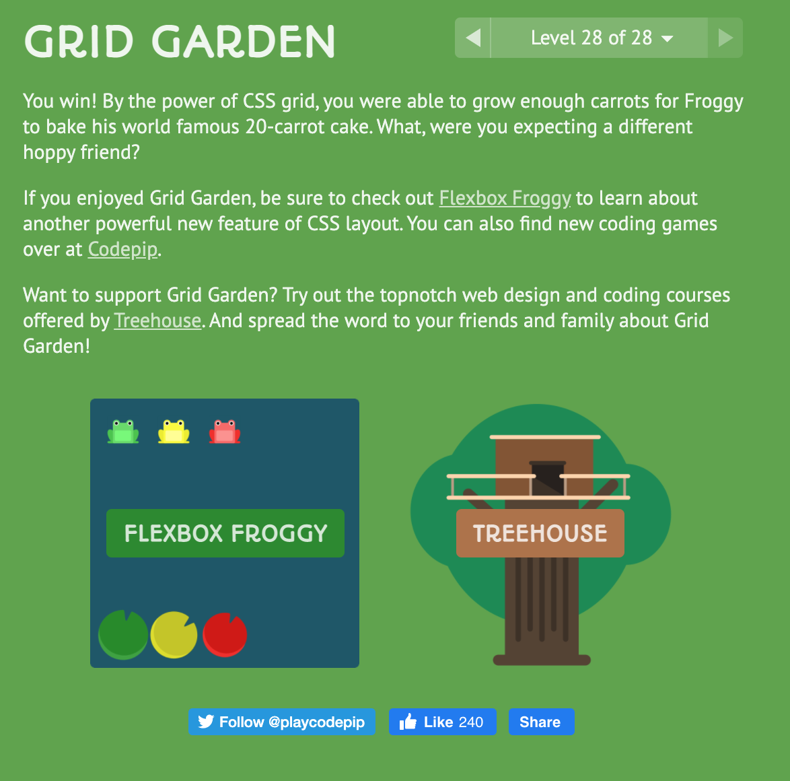
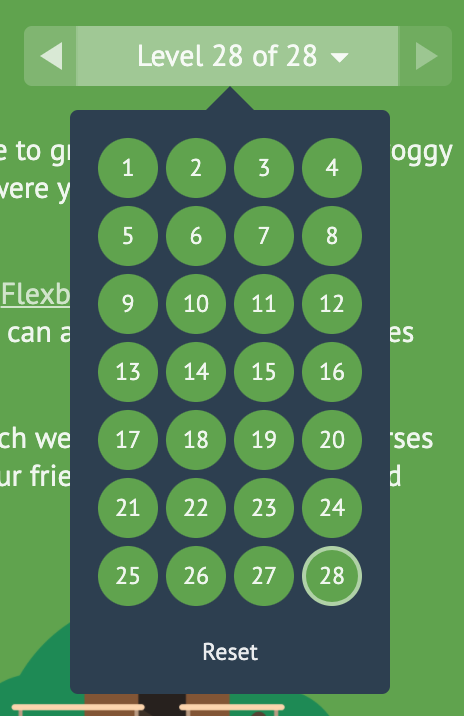

# Readings: CSS GRID

## Reading

* [CSS Grid Garden](https://cssgridgarden.com/): Complete all steps of this tutorial

## Bookmark/Skim

* [RegExr](https://regexr.com/) - Pay particular attention to the cheatsheet
* [Regex Tutorial](https://medium.com/factory-mind/regex-tutorial-a-simple-cheatsheet-by-examples-649dc1c3f285)
* [Regex 101](https://regex101.com/)
* [CSS Grid Reference](https://css-tricks.com/snippets/css/complete-guide-grid/)
* [Responsive design with CSS Grid](https://medium.com/samsung-internet-dev/common-responsive-layouts-with-css-grid-and-some-without-245a862f48df)

## CSS Grid Garden Exercise 

[⬅ Back to README Home](README.md)
