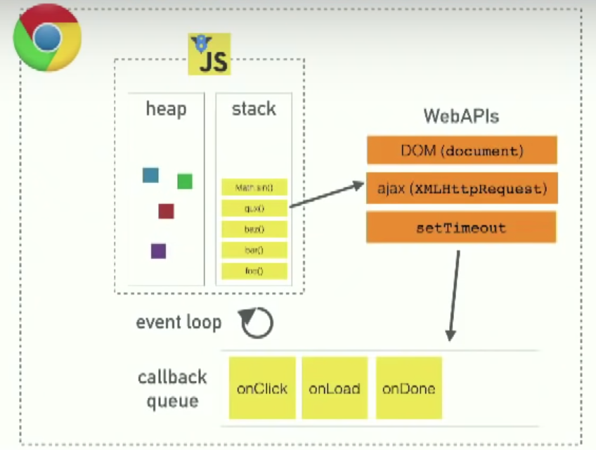

## Read the following articles

- [Solving Problems](https://simpleprogrammer.com/solving-problems-breaking-it-down/)
- [Act like you make $1000/hr](https://medium.com/swlh/pretend-your-time-is-worth-1-000-hour-and-youll-become-100x-more-productive-f04628bb3e6d)
- [How to think like a programmer](https://www.freecodecamp.org/news/how-to-think-like-a-programmer-lessons-in-problem-solving-d1d8bf1de7d2/)
- [The 5 Whys](https://www.mindtools.com/pages/article/newTMC_5W.htm)

## Watch these videos

- [what the heck is the event loop anyway](https://www.youtube.com/watch?v=8aGhZQkoFbQ)
- [The Super Mario Effect](https://www.youtube.com/watch?v=9vJRopau0g0)

### Solving Problems

"Measure twice, cut once": Make a game plan before you start writting code. In the following steps, 70% of your time should be spent on steps 1-3: 

1. Read the problem completely twice: Make sure you really understand the problem! 
1. Solve the problem manually: literally write out the steps manually to better understand how you would do it with code. 
1. Optimize the manual steps: Can you do it antoher way? What order should your steps go in? Essentially simplify the manual steps
1. Write the manual steps as comments or pseudo-code: Start bringing in some lines of code and some simple syntax and coding terms
1. Replace the comments or pseudo-code with real code: NOW start to write actual code
1. Optimize the real code: can you refactor? Are things repeating that you could combine? Do your variables have meaningful names?

### Act like you make $1000/hr

- Place value on your time
- Remove 'Busyness' and 'stress' habits from your life; try to bring in more intentional focus. 

### How to think like a programmer

- Programming is just problem solving, so it's important to have a framework for how you problem solve. 
1. Understand what you're trying to solve
1. Make a plan
1. Divide the problem into small parts
1. Help! I got stuck!
  - Debug
  - Reassess
  - Research
1. Practice! Repition is key. Finding patterns is key

### The 5 Whys

This is a theory on asking **'why?'** until you get to the root of the issue rather than the surfice level issue. 5 Why's is arbitrary, as it may take fewer or more 'whys' in actuality based on the situation or issue. Make sure your whole team is involved with this proccess, as someone from one team might have insights to the root issue that andother team wouldn't have realized without everyone being present. 

### What the heck is the event loop anyway?

JavaScript Runtime
- Heap: Memory Allocation
- Stack: stackframes, execution contexts

Blocking
- JS is a single threaded language meaining it runs one piece of code at a time. 
  - Because of this, issues come into play with the callstack when certain scripts have a slow runtime
  - Blocking the stack creates a cluncky UI

Event Loop & Concurrency
- While JS runtime can only do one thing at a time...the browser is more than just the JS runtime, like **WebAPIs** 
  - setTimeout is *actually* built into the browser; it comes from a webAPI, so it gets pushed to the webapis part of the event loop first before being processed in the task queue, and the finally making it to the callstack. 
  - WebAPIs push these call backs into a **task queue**

Sync vs Async
- Synchronous: Things (for the most part) are running in the callstack
- Asynchronous: setTimeout() starts in the Web APIs, then moves items into the Callback Queue, then they clear in the Call Stack. 

Random take-aways
- DOM is actually a web API!
- When an error happens you will get the state of the stack when the error happens in your console!
- There's essentially a **Render Queue** and a **Callback Queue**. The Render Queue takes priority. 

### The Super Mario Effect

View failure as a game rather than a penalization! It's an opportunity to learn from your failure rather than giving up i.e.The Super Mario Effect. When you don't see failing in a negative light you typically see more success. It's all about how you frame the learning processes. Even tests can be seen as a game :). The approach to programming can also be viewed as a game!